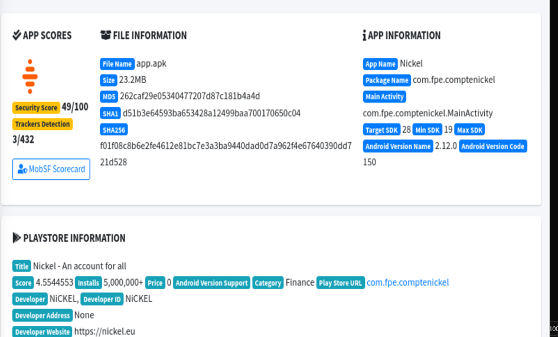

# US 2 : Analyse automatisée avec MobSF

**Score global de sécurité**

L’analyse de l’application avec MobSF montre un Security Score de 49/100.  
Ce score indique un niveau de sécurité moyen, avec plusieurs failles nécessitant des corrections.

Le nombre de trackers détectés est de 3 sur 432 connus, ce qui indique la présence limitée mais existante de services de suivi.

**Informations générales de l’application**

L’application analysée est une application bancaire nommée **Nickel**.

- Nom de l’application : Nickel
- Package : com.fpe.comptenickel
- Version : 2.12.0 (build 150)
- Catégorie : Finance
- Téléchargements : plus de 5 000 000

Cette application est donc largement déployée et manipule des données sensibles.

**Trackers détectés**

L’analyse a identifié **3 trackers sur 432 possibles**.

Ces trackers sont utilisés pour :

- l’analyse d’usage de l’application
- la collecte de données utilisateur
- le suivi comportemental

Même si le nombre est faible, leur présence pose un enjeu de confidentialité, notamment pour une application bancaire.

**Vulnérabilités identifiées**

**Version Android minimale trop ancienne**

L’application supporte Android 4.4 (API 19), une version obsolète.  
Ces systèmes ne reçoivent plus de mises à jour de sécurité, ce qui les rend vulnérables à des attaques connues.

**Version cible insuffisamment récente**

Le target SDK est fixé à 28, ce qui ne permet pas de bénéficier des dernières protections de sécurité Android.  
Cela limite l’application face aux nouvelles restrictions du système.

**Surface d’attaque élevée**

L’application gère des données sensibles comme :

- IBAN
- carte bancaire
- transactions financières

Une faille de sécurité aurait donc un impact critique.

