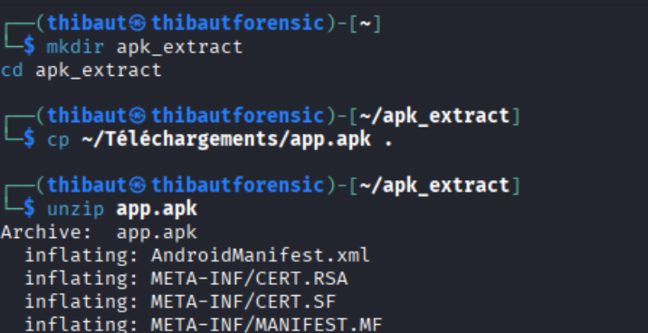
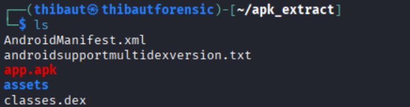
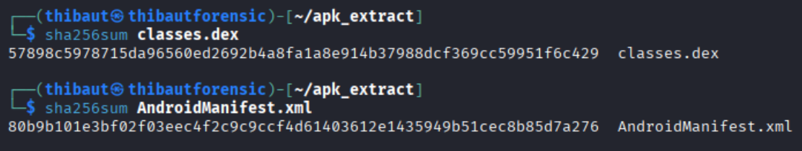

# US 3 : Analyse automatisée avec MobSF

préparer une décompilation DoD fichiers livré avec hash SHA256.

Extraire l’APK

L’APK est traité comme une archive ZIP. Après extraction, les fichiers suivants ont été récupérés :

- classes.dex
- AndroidManifest.xml

**Empreintes SHA-256**

Afin de garantir l’intégrité des fichiers extraits, les empreintes SHA-256 ont été calculées

