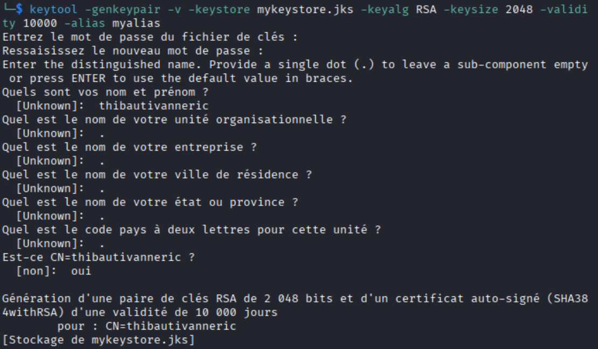
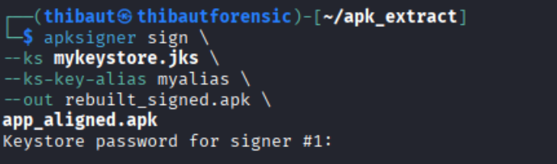
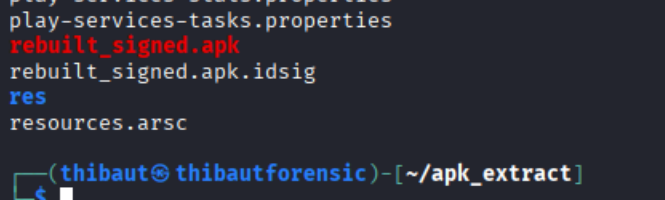
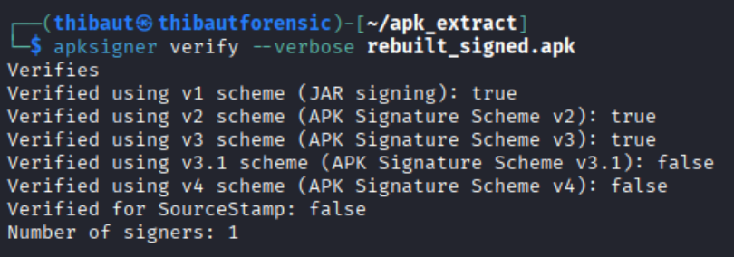

# Story 7 : Signature de l’APK

Création de la clé pour signez l’app

Le fichier **rebuilt_signed.apk** a été généré avec succès à partir de l’APK recompilé, puis signé à l’aide d’un keystore afin de le rendre installable sur un appareil Android ou un émulateur.

Signature de l’app :

Verification :

La signature a ensuite été vérifiée à l’aide de l’outil apksigner avec la commande de vérification en mode verbose. Le résultat confirme que l’APK est correctement signé et exploitable.

La vérification indique que les schémas de signature v1 (JAR), v2 (APK Signature Scheme v2) et v3 sont valides, ce qui prouve que l’APK est correctement sécurisé et reconnu par le système Android. Le nombre de signataires est de 1, ce qui correspond à la clé utilisée lors de la signature.

