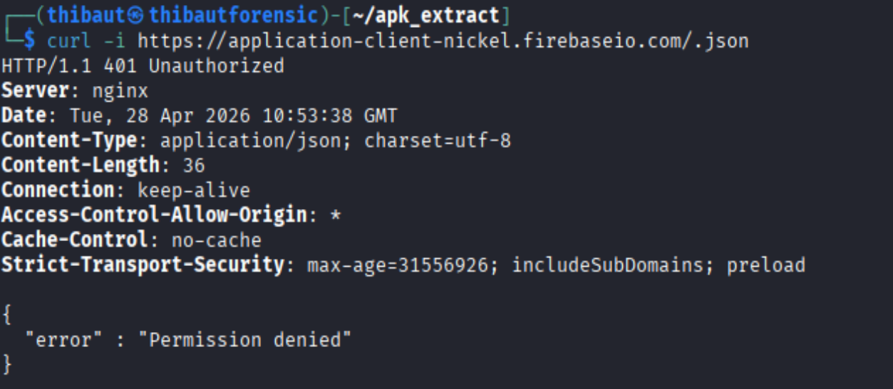

# Story 8 : Vérification Firebase

**Analyse**

La base Firebase n’est pas accessible publiquement.

- L’accès est protégé par des règles d’authentification
- Toute tentative d’accès sans autorisation est refusée (401 Unauthorized)
- Aucun contenu sensible n’est exposé dans la réponse

**Niveau de risque**

- Pas de fuite de données directe détectée
- Contrôle d’accès actif
- Risque faible sur cet endpoint

Cependant, cet endpoint reste sensible car une mauvaise configuration des règles Firebase pourrait exposer des données critiques (utilisateurs, transactions, etc.).